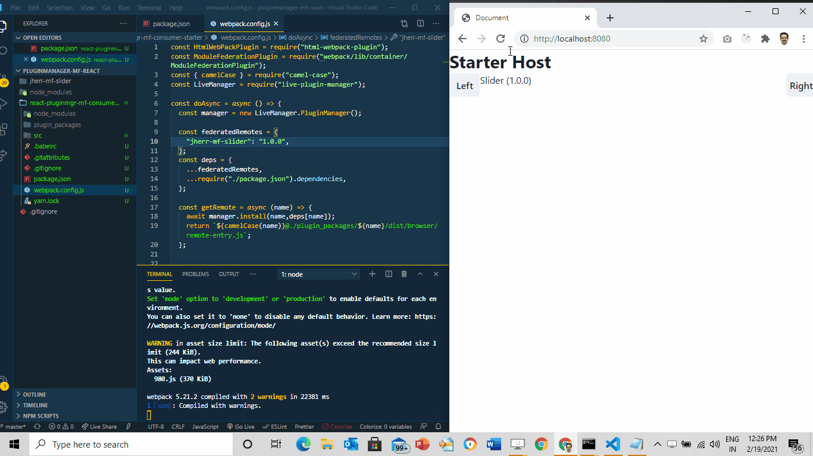

# Plugin Manager with Module Federation

- This an experiment to directly work with npm modules via the `live-plugin-manager` integration with Module Federation
- The project is a fork of the excellent video tutorial by [Jack Herrington](https://www.youtube.com/watch?v=ZFNxTy3fOO0&t=10s) and replaces the access of resources from unpkg.com to directly accessing these from the npm repo and integrating it with the Module Federation Plugin.
- One possible advantage will be to have the modules local so that network requests at runtime will reduce as all those remote modules are actually available locally now. The startup will be slightly slower because the plugin manager will download the dependencies first, but that should be ok as that is only at the initial and there are ways where you can optimize this as mentioned in the [live-plugin-manager docs](https://www.npmjs.com/package/live-plugin-manager)

